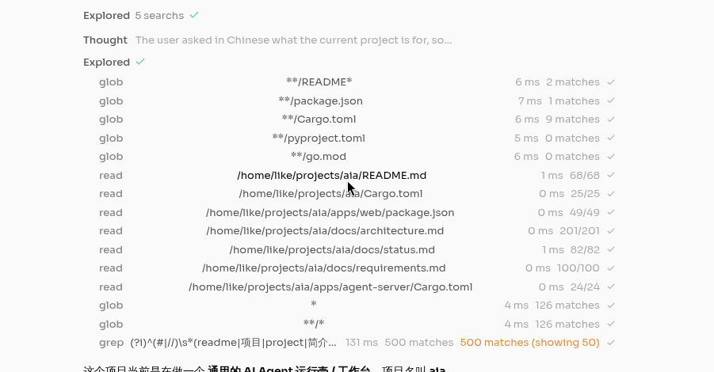

> 这里是用户记录的问题追踪，ai解决后需要标记完成

# ~~重要： 上下文自动压缩~~ ✅ 已完成

参考 bub / republic 实现，优化了上下文压缩机制。

## 设计决策

**Handoff 语义**：写入 anchor → 附带最小继承状态（summary）→ 执行起点迁移至 anchor 之后。

**anchor_state_message 简化**：
- 仅注入 summary 文本，格式：`[context summary]\n{summary}`
- Role 改为 `User`（不干扰 system prompt / instructions）
- 移除所有元数据：`source_entry_ids`、`owner`、`phase`、`next_steps`
- 无摘要时不注入（返回 `Option<Message>`）

**新增 tape_info / tape_handoff 工具**：
- `tape_info`：返回上下文统计（entries、anchors、pressure_ratio 等），让 agent 感知上下文用量
- `tape_handoff`：agent 主动创建 anchor 截断历史，传入 summary 作为最小继承状态
- 两个工具由 runtime 拦截执行（需访问 SessionTape），不经过 builtin-tools

**自动压缩（安全回退）保留**：
- 压力 ≥80% 时 pre-turn 自动压缩
- `context_length_exceeded` 错误时重试压缩
- 改进了 SUMMARY_PROMPT，生成更结构化的摘要

**context_contract**：
- 在 system instructions 中追加 `<context_contract>` 块
- 提示 agent 使用 tape_info 和 tape_handoff 管理上下文

**orphaned tool_result 过滤**：
- `tape_handoff` 会在 tool_call 和 tool_result 之间创建 anchor
- anchor 之前的 tool_call 被截断，留下孤立的 tool_result
- `drop_orphaned_tool_results()` 在构建 CompletionRequest 时过滤

## 参考分析

- **bub**: ForkTapeStore 事务隔离 + context_contract 让 agent 自管理 + tape_info/tape_handoff 工具
- **republic**: TapeQuery 丰富查询（after_anchor/between_anchors/between_dates） + TapeContext 可定制投影
- **共同模式**: append-only 时间线、anchor 分界点、JSONL 存储

---

# ~~一般： 前端 tool 展示问题~~ ✅ 已完成

1. ~~如图所示，tool 调用的内容，都居中了~~
   - 已修复：使用 `grid-cols-[80px_1fr_auto]` 布局替代 `flex`，确保三列（工具名、路径、状态）左对齐且结构稳定
   - 优化了 tool 列表的间距，添加 `space-y-0.5` 提升视觉层次

---

# 重要： 是否需要支持多个会话

## Future TODO — 多会话隔离

- 参考 bub 的 workspace_hash__session_hash 命名隔离
- 参考 republic 的 tape name 独立命名
- 需要考虑：如何创建/切换/列出会话，后端 session 路由，前端会话列表
- 当前 aia 只有单会话单 JSONL 文件

1. 怎么创建多个会话
2. 后端server需要做哪些修改
3. 前端怎么兼容
4. session消息文件还是用jsonl存储吗？
5. session有没有一些结构化信息需要用数据库存储
6. /home/like/projects/bub /home/like/projects/republic  里面是怎么实现的

---

# Future TODO — 主题编织 / Topic Recall

- 概念：每个 topic 绑定一个 anchor，重复 topic 触发 recall
- bub 和 republic 中均未实现此特性
- bub 的 tape.search（模糊搜索 entries）可作为基础
- 需要设计：topic 识别、anchor-topic 绑定、跨 anchor recall 机制

---

# Tape System 架构参考笔记

供后续开发参考：

- **bub**: ForkTapeStore 事务隔离 + context_contract 让 agent 自管理
- **republic**: TapeQuery 丰富查询（after_anchor/between_anchors/between_dates） + TapeContext 可定制投影
- **共同模式**: append-only 时间线、anchor 分界点、JSONL 存储

# 生成式 UI（Generative UI）Widget 系统

- 本地设计文章：`docs/generative-ui-article.md`
- 外部参考：
  - https://github.com/op7418/CodePilot/blob/85a07daa93dbc91015259f88cee64f7cc54d090e/docs/handover/generative-ui.md?plain=1#L103
